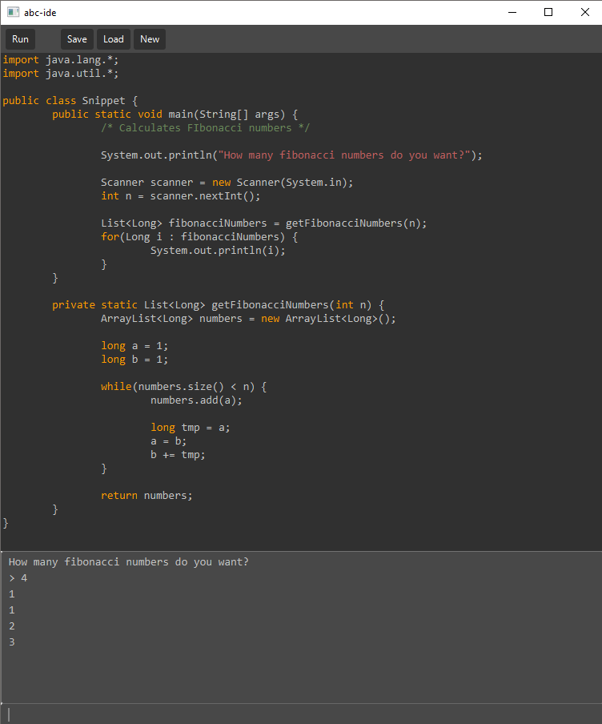

## abc-ide
An code snippet editor made with Java + JavaFX for Javalabra course.
Supports auto-indent, syntax higlighting and compiling and running files with a click of a button. stdin/stdout of the program is captured and shown on a console inside the program.

 

## Documentation
- [Time usage](/dokumentaatio/tuntikirjaus.md)
- [Design document (in Finnish)](/dokumentaatio/aihemäärittely.md)
- [Class Diagram](/dokumentaatio/luokkakaavio.png)  
- [Instructions (in Finnish)](/dokumentaatio/kayttoohje.md)

- [PIT-report](https://htmlpreview.github.io/?https://github.com/JaakkoLipsanen/abc-ide/blob/master/dokumentaatio/pit-raportti/index.html)
- [Checkstyle-report](https://htmlpreview.github.io/?https://github.com/JaakkoLipsanen/abc-ide/blob/master/dokumentaatio/checkstyle-raportti/checkstyle.html)
